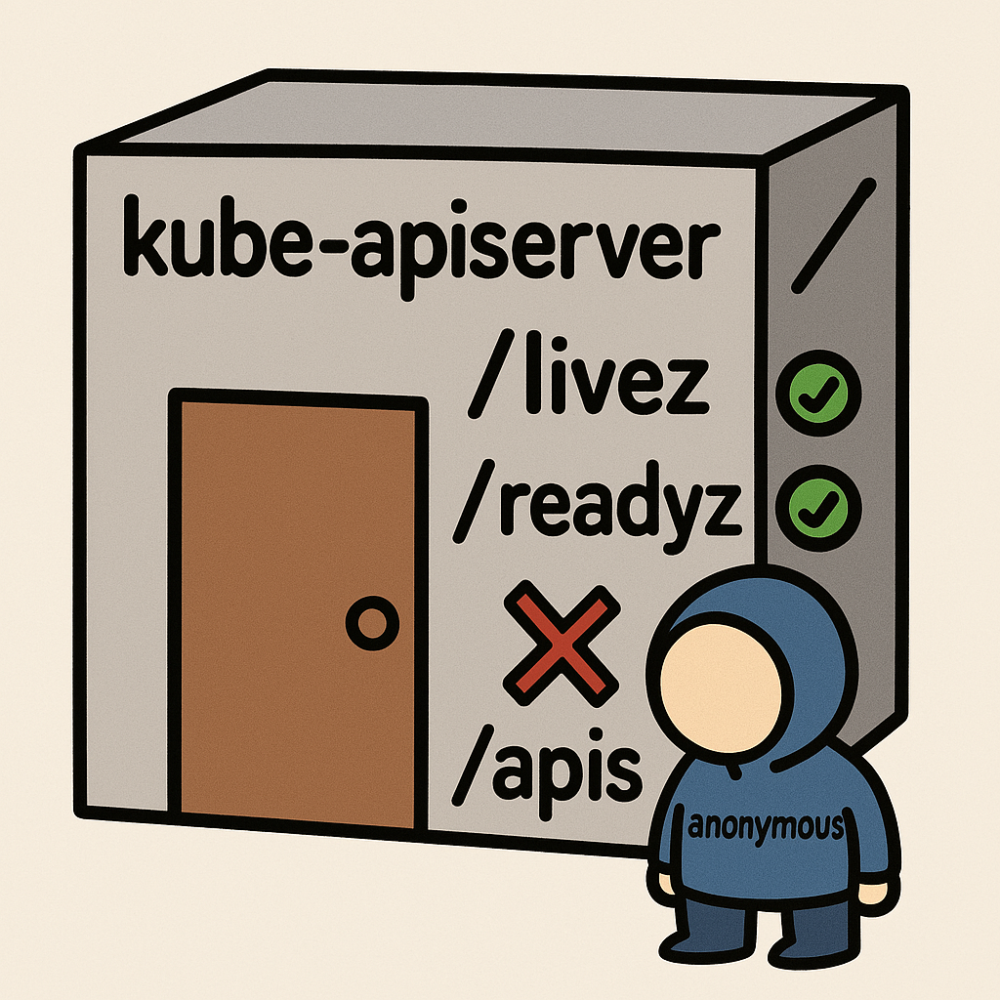
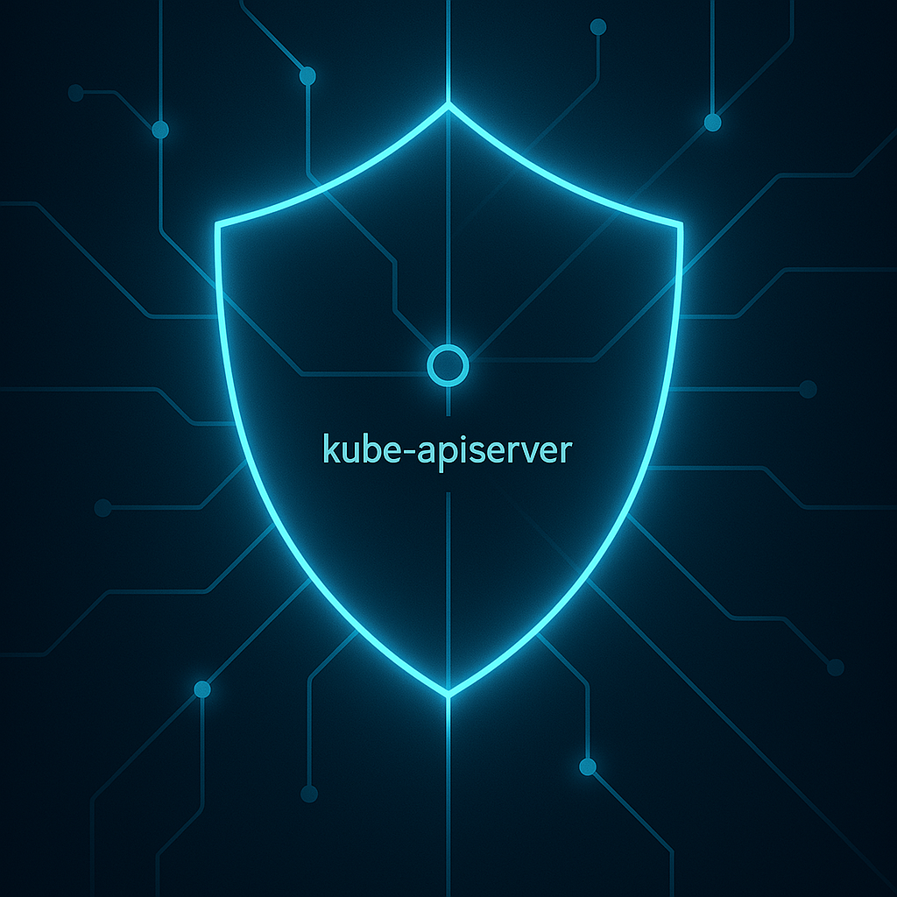
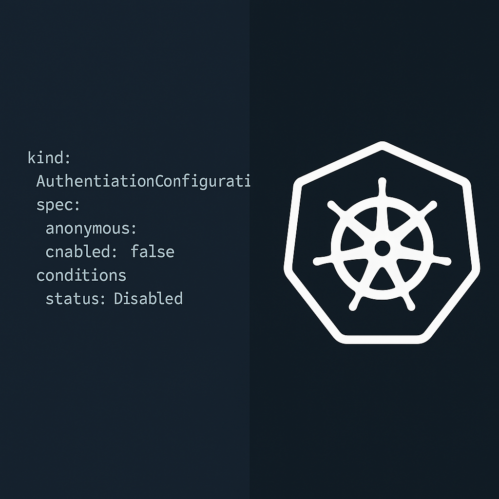
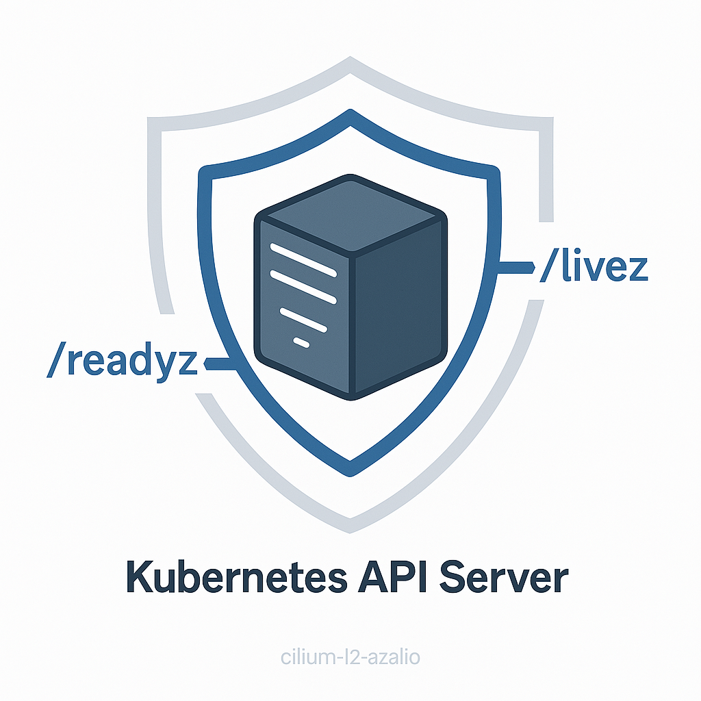

# Image Generation Prompts for Kubernetes Authentication Post

## 1. Telegram

*   "A stylized Kubernetes logo with a large, friendly padlock securely attached to it. Simple, clear lines, vibrant blue and white colors, sticker style."
*   "A cartoonish diagram showing a 'kube-apiserver' box with a green checkmark on '/livez' and '/readyz' paths, but a red 'X' on the main entrance labeled '/apis'. A small character labeled 'anonymous' is blocked at the main entrance. Tech meme style."
""

## 2. Medium

*   "Abstract digital art representing network security and access control. Glowing blue lines forming a shield protecting a central node labeled 'kube-apiserver'. Dark background, professional and clean aesthetic."

*   "Conceptual image of multiple keys trying to access different doors on a futuristic server rack labeled 'Kubernetes API'. Only specific keys labeled '/livez' and '/readyz' fit their locks, while others are denied. Minimalist, high-tech style."

## 3. dev.to

*   "A split image: left side shows lines of YAML configuration code related to Kubernetes authentication (`AuthenticationConfiguration`, `anonymous`, `conditions`), right side shows a stylized shield icon with the Kubernetes wheel logo integrated. Tech blog header style."

*   "Illustration of a developer looking at a secure Kubernetes cluster diagram on a screen. The diagram highlights the `kube-apiserver` with specific allowed paths (`/livez`, `/readyz`) green-lit and others blocked. Flat design, developer-focused."

## 4. LinkedIn

*   "Professional graphic depicting a secure network architecture. A central server icon labeled 'Kubernetes API Server' is protected by a firewall/shield, with specific entry points highlighted for health checks. Clean lines, corporate blue and grey colors."

*   "An image representing data security and compliance in a cloud environment. Abstract padlock overlaying a subtle Kubernetes cluster background. Focus on trust and security, professional banner style."